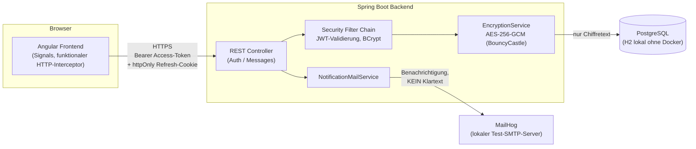

https://github.com/user-attachments/assets/92025681-7849-47be-80c0-7d2f9405be36

# Secure Mailbox – Demo-Projekt

Eine kleine, aber vollständige Full-Stack-Anwendung für Ende-zu-Ende-artige,
verschlüsselte Nachrichten – gebaut als Referenzprojekt für ein
Vorstellungsgespräch bei **PrivaSphere AG** (sicheres E-Mail / verschlüsselte
Online-Anwendungen). Der Tech-Stack und die Design-Entscheidungen orientieren
sich bewusst an der dortigen Stellenausschreibung (Java, RDBMS,
TypeScript/Angular, Docker, Kubernetes, IT-Security, automatisierte Tests).

> **Hinweis:** Dies ist ein Lern-/Demo-Projekt, keine produktionsreife
> Software. Wo bewusst vereinfacht wurde, ist das im Text und in
> [Bekannte Einschränkungen](#bekannte-einschränkungen--nächste-schritte)
> transparent gemacht.

---

## Inhaltsverzeichnis

1. [Überblick](#überblick)
2. [Architektur](#architektur)
3. [Tech-Stack](#tech-stack)
4. [Sicherheitsmodell](#sicherheitsmodell)
5. [Wichtige Design-Entscheidungen](#wichtige-design-entscheidungen)
6. [Teststrategie](#teststrategie)
7. [Setup & Ausführen](#setup--ausführen)
8. [Projektstruktur](#projektstruktur)
9. [Bekannte Einschränkungen & nächste Schritte](#bekannte-einschränkungen--nächste-schritte)
10. [Bezug zur Stellenausschreibung](#bezug-zur-stellenausschreibung)

---

## Überblick

Nutzer:innen können sich registrieren, sich einloggen und einander
Nachrichten schicken. Jede Nachricht wird serverseitig mit **AES-256-GCM**
verschlüsselt in der Datenbank gespeichert – gespeichert wird ausschliesslich
der Chiffretext, nie der Klartext. Beim Empfang einer neuen Nachricht wird
zusätzlich eine **Benachrichtigungs-Mail** verschickt, die bewusst **keinen**
Klartext-Inhalt enthält (dasselbe Prinzip wie bei echten sicheren
Mail-Diensten: der unverschlüsselte E-Mail-Kanal dient nur als Hinweis,
"schau in der sicheren Anwendung nach").

Die Anwendung läuft wahlweise:

- lokal ohne Container (H2-Datenbank, direkt über IntelliJ/`ng serve`),
- vollständig containerisiert über **Docker Compose** (Postgres + MailHog),
- oder in einem lokalen **Kubernetes**-Cluster (Minikube/kind).

## Architektur



**Warum diese Trennung von Zugriffskontrolle und Verschlüsselung?**
Das sind zwei unabhängige Schutzschichten mit unterschiedlichen
Bedrohungsmodellen: Die Verschlüsselung schützt vor einem DB-Leak
(jemand bekommt Zugriff auf die Datenbank direkt), die Zugriffskontrolle
(Spring Security + JWT) schützt vor unautorisierten API-Zugriffen. Beides
zusammen ergibt Tiefenverteidigung ("Defense in Depth") – eines allein
reicht nicht: verschlüsselte Daten hinter einer offenen API sind genauso
verwundbar wie eine zugriffsgeschützte API mit Klartext-Daten in der DB.

## Tech-Stack

| Bereich | Technologie | Warum |
|---|---|---|
| Backend-Sprache | Java 21 | LTS-Version, Records/Pattern-Matching für schlanke DTOs |
| Backend-Framework | Spring Boot 3 | Industriestandard, deckt REST/Security/JPA/Mail aus einer Hand ab |
| Datenbank | PostgreSQL (Docker/K8s) / H2 (lokal) | Postgres als "echte" RDBMS für produktionsnahes Verhalten, H2 für schnelle lokale Iteration ohne Docker |
| ORM | Spring Data JPA / Hibernate | Standard-Wahl im Spring-Ökosystem |
| Verschlüsselung | AES-256-GCM via BouncyCastle | Authenticated Encryption (schützt Vertraulichkeit UND Integrität); BouncyCastle explizit statt Default-JCE-Provider |
| Authentifizierung | Spring Security, JWT (JJWT), BCrypt | Stateless Access-Token + widerrufbarer Refresh-Token (Details siehe [`AUTHENTICATION.md`](./AUTHENTICATION.md)) |
| E-Mail | JavaMail (`spring-boot-starter-mail`), MailHog | Benachrichtigungsversand; MailHog simuliert einen MTA (wie Postfix) lokal, inkl. Web-UI zum Einsehen versendeter Mails |
| Frontend-Framework | Angular 22 (Standalone Components, Signals) | Aktuelle Angular-Architektur ohne NgModules; Signals lösen Change Detection zuverlässig aus, unabhängig von Zone.js |
| Sprache Frontend | TypeScript | Typsicherheit über die gesamte HTTP-Schicht (DTOs als Interfaces) |
| HTTP-Layer | Angular `HttpClient` + funktionaler Interceptor | Automatisches Anhängen des Access-Tokens, Retry-Logik bei abgelaufenem Token |
| Backend-Unit-Tests | JUnit 5, Mockito, AssertJ | Verhaltenstests statt Implementierungsdetails (siehe [Teststrategie](#teststrategie)) |
| Backend-Integrationstests | Spring `MockMvc`, `spring-security-test` | Testet die echte Security-Filterkette end-to-end |
| Frontend-Unit-Tests | Vitest | Seit Angular 21 der Standard-Test-Runner (löst Karma/Jasmine ab) |
| E2E-Tests | Cypress | Testet den kompletten Fluss durchs echte UI gegen laufendes Backend |
| Containerisierung | Docker, Docker Compose | Multi-Stage-Builds (Build- und Runtime-Stage getrennt) für schlanke Images |
| Orchestrierung | Kubernetes (Minikube/kind) | Deployments/Services/Secrets/PVC für Postgres, Backend, Frontend, MailHog |

## Sicherheitsmodell

Ausführlich dokumentiert in [`AUTHENTICATION.md`](./AUTHENTICATION.md). Kurzfassung:

- **Verschlüsselung ruhender Daten:** AES-256-GCM, pro Nachricht ein neuer
  Initialisierungsvektor. Der Master-Key liegt (nur für diese Demo!) in
  Config/Umgebungsvariablen statt in einem Vault/HSM.
- **Authentifizierung:** Access-Token (JWT, 15 Min. gültig, nur im
  Frontend-Speicher, nie in `localStorage`) + Refresh-Token (7 Tage,
  `httpOnly`+`Secure`+`SameSite=Strict`-Cookie, serverseitig als Hash
  gespeichert und bei jeder Nutzung **rotiert** – ein Token ist nur genau
  einmal gültig).
- **Autorisierung / IDOR-Fix:** Wer "ich" ist, ergibt sich ausschliesslich
  aus dem validierten Token – es gibt keinen Endpunkt mehr, der einen
  fremden Benutzernamen als Parameter entgegennimmt. Ende-zu-Ende mit zwei
  echten Nutzern getestet (`MessageControllerIsolationTest`).
- **Passwörter:** BCrypt-Hash, Mindestlänge 12 Zeichen (NIST SP 800-63B:
  Länge statt erzwungener Zeichenklassen-Mischung).
- **User-Enumeration-Schutz:** Login liefert bei falschem Passwort und bei
  unbekanntem Benutzernamen dieselbe Fehlermeldung.
- **Benachrichtigungs-Mail ohne Klartext:** schützt den Nachrichteninhalt
  auch dann, wenn der unverschlüsselte SMTP-Kanal mitgelesen würde.

## Wichtige Design-Entscheidungen

Eine kuratierte Liste von "Warum X und nicht Y"-Entscheidungen – gedacht als
eigene Gesprächsgrundlage, nicht nur als Nachschlagewerk:

- **AES-GCM statt AES-CBC:** GCM ist eine authentifizierte Betriebsart
  (erkennt Manipulation am Chiffretext dank Auth-Tag), CBC allein bietet nur
  Vertraulichkeit, keine Integrität.
- **JWT (Access) + serverseitiger Refresh-Token statt reinem
  Session-Cookie:** ermöglicht zustandslose Skalierung des Backends
  (mehrere Instanzen ohne geteilten Session-Store) bei gleichzeitiger
  Widerrufbarkeit über den Refresh-Token.
- **Refresh-Token als `httpOnly`-Cookie statt im `localStorage`:** JavaScript
  (und damit ein XSS-Angreifer) kann den Cookie gar nicht erst auslesen.
- **BouncyCastle statt Standard-JVM-JCE-Provider:** explizite Kontrolle über
  die verwendete Crypto-Implementierung statt sich auf JVM-Vendor-Defaults
  zu verlassen.
- **`columnDefinition="TEXT"` statt `@Lob` für den Chiffretext:** `@Lob`
  hätte Hibernate bei Postgres dazu gebracht, einen Large Object (OID) zu
  verwenden, der nur innerhalb einer Transaktion lesbar ist – unsere
  Read-Endpunkte laufen aber im Auto-Commit-Modus.
- **H2 lokal, Postgres in Docker/K8s:** schnelle Iteration ohne
  Docker-Zwang während der Entwicklung, aber produktionsnahes DB-Verhalten
  überall dort, wo es zählt (Docker/K8s-Umgebungen).
- **Angular Signals statt klassischer Zone.js-basierter Change Detection:**
  löste einen konkreten Bug (UI aktualisierte sich nicht automatisch nach
  asynchronen HTTP-Antworten) und ist der aktuell empfohlene Ansatz.
- **`strategy: Recreate` statt `RollingUpdate` beim Postgres-Deployment in
  K8s:** ein `ReadWriteOnce`-Volume verträgt keine zwei gleichzeitig
  laufenden Pods.
- **Kein Rate-Limiting auf `/api/auth/login` (bewusst nicht umgesetzt):**
  transparent als Lücke dokumentiert statt stillschweigend weggelassen –
  siehe [Bekannte Einschränkungen](#bekannte-einschränkungen--nächste-schritte).

## Teststrategie

Drei Ebenen, jede mit einem anderen Zweck:

| Ebene | Tool | Was getestet wird |
|---|---|---|
| Backend Unit-Tests | JUnit 5 + Mockito | Einzelne Services isoliert: Verschlüsselung (inkl. Manipulationserkennung), Refresh-Token-Rotation, Mail-Versand-Fehlerbehandlung |
| Backend Integrationstests | `MockMvc` + echter Spring-Kontext | Die komplette Security-Filterkette: Registrierung, Login, Token-Refresh-Rotation samt Ablehnung wiederverwendeter Tokens, IDOR-Isolation mit zwei echten Nutzern |
| Frontend Unit-Tests | Vitest | Services (`AuthService`, `MessageService`) und der HTTP-Interceptor (Token-Anhängen, Retry-bei-401-Logik) isoliert von echten Netzwerkaufrufen |
| E2E-Tests | Cypress | Der komplette Weg durchs echte UI gegen ein laufendes Backend: Registrierung → Login → Nachricht senden → im Posteingang sehen, inklusive Fehlerfällen |

**Bewusstes Prinzip:** Unit-Tests prüfen *Verhalten*, nicht
*Implementierungsdetails* – z.B. testet `RefreshTokenServiceTest` nicht die
konkrete Hash-Funktion nach, sondern nur, dass Rotation/Ablehnung korrekt
funktionieren. Das hält die Tests robust gegen harmlose interne Änderungen.

**Ausführen:**

```bash
# Backend
cd backend
mvn test

# Frontend Unit-Tests
cd frontend
npm test

# Frontend E2E (braucht laufendes Backend + `ng serve`, siehe unten)
npm run e2e:ci
```

## Setup & Ausführen

### Option A: Lokal ohne Container (schnellste Iteration)

```bash
# Backend (nutzt H2, in-memory)
cd backend
mvn spring-boot:run
```

```bash
# Frontend
cd frontend
npm install
ng serve
```

Browser: `http://localhost:4200`

### Option B: Docker Compose (Postgres + MailHog, produktionsnäher)

```bash
cp .env.example .env   # falls noch nicht vorhanden - Werte anpassen
docker compose up --build
```

- Anwendung: `http://localhost:4200`
- MailHog-Weboberfläche (versendete Benachrichtigungs-Mails ansehen):
  `http://localhost:8025`

### Option C: Kubernetes (Minikube/kind)

Ausführliche Schritt-für-Schritt-Anleitung in
[`k8s/README-k8s.md`](./k8s/README-k8s.md), inklusive Image-Build,
Laden ins lokale Cluster und `kubectl port-forward`-Setup.

## Projektstruktur

```
secure-mailbox-demo/
├── AUTHENTICATION.md        # Tiefgehende Doku zum Auth-/IDOR-Fix
├── README.md                # Diese Datei
├── docker-compose.yml
├── .env.example
├── backend/
│   ├── src/main/java/securemailbox/
│   │   ├── controller/      # REST-Endpunkte (Auth, Messages)
│   │   ├── service/         # Verschlüsselung, Nachrichten-Logik, Mail
│   │   ├── security/        # JWT, UserDetailsService, Refresh-Token-Logik
│   │   ├── entity/          # JPA-Entities
│   │   ├── repository/      # Spring Data Repositories
│   │   ├── dto/              # Request-/Response-Objekte
│   │   ├── config/           # SecurityConfig
│   │   └── exception/        # Globale Fehlerbehandlung
│   └── src/test/java/...     # Unit- & Integrationstests, gleiche Paketstruktur
├── frontend/
│   ├── src/app/
│   │   ├── services/         # AuthService, MessageService
│   │   ├── interceptors/     # Funktionaler Auth-Interceptor
│   │   ├── models/           # TypeScript-Interfaces
│   │   └── app.component.*   # Einzige Haupt-Komponente (Login/Register/Inbox)
│   └── cypress/
│       ├── e2e/              # auth.cy.ts, messaging.cy.ts
│       └── support/          # Custom Commands (z.B. registerNewUser)
└── k8s/
    ├── README-k8s.md
    ├── secret.yaml
    ├── postgres.yaml
    ├── mailhog.yaml
    ├── backend.yaml
    └── frontend.yaml
```

## Bekannte Einschränkungen & nächste Schritte

Bewusst transparent gehalten - das sind Punkte, die in einem produktiven
System als Nächstes angegangen würden, aus Zeitgründen hier aber
(noch) nicht umgesetzt sind:

- **Kein Rate-Limiting/Brute-Force-Schutz** auf `/api/auth/login`.
- **Keine E-Mail-Verifikation** vor der ersten Anmeldung (die JavaMail-Infra
  dafür ist schon da, liesse sich nach demselben Muster wie der
  Refresh-Token umsetzen).
- **Ein einziger globaler Verschlüsselungs-Key für alle Nutzer** statt
  echter Ende-zu-Ende-Verschlüsselung mit individuellen Schlüsselpaaren pro
  Nutzer (asymmetrisch, z.B. RSA-Schlüsselaustausch + AES-Session-Key). Das
  wäre der konsequente nächste Schritt in Richtung eines echten
  PrivaSphere-artigen Modells.
- **Kein CI/CD-Pipeline-Setup** (z.B. GitHub Actions, die Tests automatisch
  bei jedem Push laufen lassen).
- **Kein Rollen-/Rechte-Modell über "eingeloggt oder nicht" hinaus**
  (`User.Role` existiert bereits als Enum, wird aber aktuell nicht für
  unterschiedliche Berechtigungen genutzt).
- **Secrets-Management:** JWT-Secret und Verschlüsselungs-Key liegen in
  Config-Dateien/Umgebungsvariablen statt in einem Vault mit Rotation.
- **Kein Löschen/Bearbeiten von Nachrichten**, kein "Gesendet"-Tab im UI
  (Backend-Endpunkt `/api/messages/sent` existiert bereits, ist aber noch
  nicht ans Frontend angebunden).

## Bezug zur Stellenausschreibung

| Anforderung (PrivaSphere) | Abgedeckt durch |
|---|---|
| Java | Spring Boot Backend |
| RDBMS | PostgreSQL (Docker/K8s), H2 (lokal) |
| JavaScript / TypeScript | Angular-Frontend, durchgängig typisiert |
| Angular | Standalone Components, Signals, funktionale Interceptors |
| CSS | Eigenes Styling in `app.component.css` |
| Docker | Multi-Stage-Dockerfiles für Backend & Frontend, Docker Compose |
| Kubernetes | Deployments/Services/Secrets/PVC in `k8s/` |
| Automatisierte Security-Test-Frameworks | JUnit, Mockito, Cypress; Tests decken explizit Security-Eigenschaften ab (IDOR, Token-Rotation, Manipulationserkennung) |
| JavaMail | `NotificationMailService`, MailHog als lokaler MTA |
| IT-Security & Kryptografie (Nice-to-have) | AES-256-GCM, BouncyCastle, BCrypt, JWT |
| Verständnis von MTAs (Nice-to-have) | MailHog simuliert einen MTA wie Postfix lokal |
| Dokumentation für wachsende Entwicklungsorganisation | Dieses Dokument, `AUTHENTICATION.md`, `k8s/README-k8s.md` |
